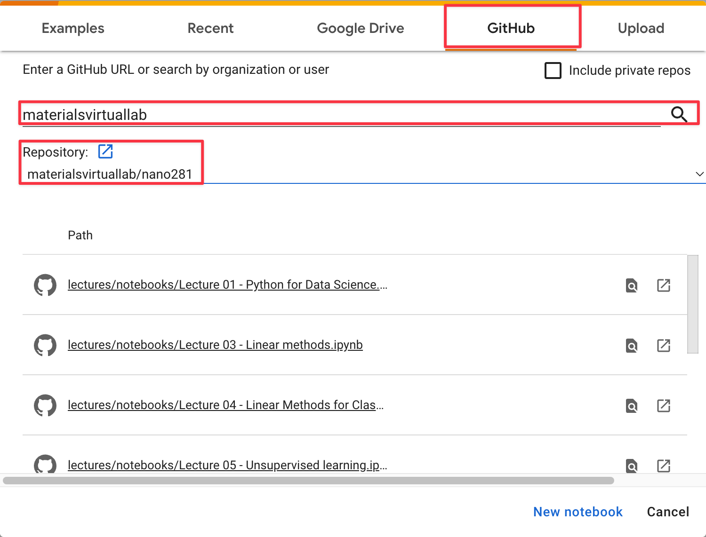

# NANOx81 - Data Science in Materials Science

Welcome to the UCSD Course NANO 181/281 ("x81") - Data Science in Materials Science. NANOx81 is a co-scheduled 
course for both undergraduates and graduate students. The aim is to provide a comprehensive introduction to the 
application of data science to materials science. The full syllabus is available [here](syllabus).

# Lecture materials

## Slides

1. [Course Admin](assets%2Fslides%2F00-Course_Admin.pdf)
2. [Python for Data Science](assets%2Fslides%2F01-Python_for_Data_Science.pdf)
3. [Data Science in Materials Science](assets%2Fslides%2F02-Introduction_to_Data_Science_in_Materials_Science.pdf)
4. [Linear Methods](assets%2Fslides%2F03-Linear_Methods.pdf)
5. [Improving and extending linear models](assets%2Fslides%2F04-Improving_and_extending_linear_models.pdf)
6. [Linear Classification](assets%2Fslides%2F05-Linear_Classification.pdf)
7. [Unsupervised Learning](assets%2Fslides%2F06-Unsupervised_Learning.pdf)
8. [Kernel Regression](assets%2Fslides%2F07-Kernel_Regression.pdf)
9. [Generalized Additive Models and Trees](assets%2Fslides%2F08-Generalized_Additive_Models_and_Trees.pdf)
10. [Neural Networks](assets%2Fslides%2F09-Neural_Networks.pdf)

## Jupyter Notebooks

In-lecture demos will be conducted using Jupyter notebooks, available [here](https://github.com/materialsvirtuallab/nano281/tree/master/lectures/notebooks).

# Course textbooks

The course is intended to be self-contained and all textbooks are optional.
However, the following are useful to have around:

1. The Elements of Statistical Learning: Data Mining, Inference, and Prediction, Second Edition
   [Amazon](https://www.amazon.com/dp/0387848576/ref=cm_sw_em_r_mt_dp_U_Z8r8DbR3HMYRE),
   or get the [free online version](https://web.stanford.edu/~hastie/Papers/ESLII.pdf).
2. Python Data Science Handbook. Buy from [Amazon](https://www.amazon.com/gp/product/1491912057/ref=ppx_yo_dt_b_asin_title_o00_s00?ie=UTF8&psc=1) 
   or get the [free online version](https://jakevdp.github.io/PythonDataScienceHandbook/).

# Labs

There are three lab sessions. The instructions for the first two labs are available via the menu on the left. The 
final lab will be an open problem that will be determined at a later date and will be held via a Kaggle competition.

# Programming language

All lectures and labs will be conducted in Python 3.9+. 

For most students, especially those that are new to python, you can simply use the [Google Colab] cloud service to 
run all lecture notebooks and do all labs. The advantage of using Google Colab is that you do not need bother with 
installation of python and the necessary libraries in your local machine. 

The main disadvantage of Google Colab is that you have to work in the cloud and often, the compute resources 
provided will not be as fast as running things on your laptop or any high performance computing system of your 
choosing. 

For serious work, you can follow the [instructions provided](setup) to install Python and 
the necessary libraries for this course.

## Using Google Colab

1. Go to [Google Colab]. Sign in with your Google account (preferably your UCSD one).
2. If you are working on a lab or creating a new notebook for your own work, exit the textbox and select `File->New 
   Notebook` from the menu.
3. If you want to work with the lecture examples, select `File-Open Notebook` from the menu.
4. Select the `Github` tab.
5. Enter `materialsvirtuallab` into the Github organization field and click the magnifying glass.
6. Under `Repository`, select the `materialsvirtuallab/nano281` repository.
7. Click on any of the notebooks to open them.

[Google Colab]: https://colab.research.google.com/