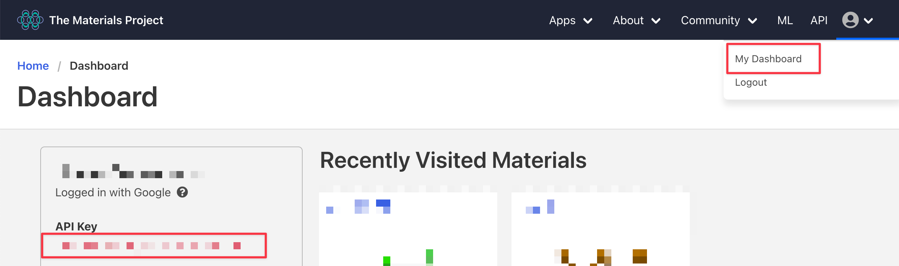

# Introduction

Welcome to Lab 1 of NANO281 - Data Science in Materials Science. In this lab, you will be learn how to handle materials data using various open-source Python tools.

# Getting started

If you have not already done so, please follow the instructions outlined in the main [README](https://github.com/materialsvirtuallab/nano281) to setup your computer.  

1. Activate your nano281 virtual environment.
```bash
conda activate nano281
```
2. Start a Jupyter notebook
```bash
jupyter notebook
```
3. Create a Python 3 notebook and rename it `nano281-lab1-<first_name>-<last_name>`. This is important because I expect to be receiving a notebook from every student.

# Assessment criteria

Try to complete all questions, doing everything in your Jupyter notebook. Make generous use of code cells, text cells, etc. and write your notebook as though it is a lab report but with Python code incorporated. The easier you make it for your instructors to find the answers, the better.

At the end of the lab, please submit the `nano281-lab1-<first_name>-<last_name>.ipynb` file (it should be in whatever directory you started your jupyter notebook application in) via Google classroom.

Just a reminder on our assessment criteria:
- Model performance: 30%
- Materials Science Insights: 30%
- Data Science Technique: 30%
- Programming Style: 10%

For this first lab, you will not be building any models. So the primary evaluation is based on the data science technique and programming. **First and foremost, you should ensure that any notebook you submit for your labs can be executed completely without errors.** The easiest way to do this is to do a "Restart and Run All" from the notebook, which will execute all cells in your Jupyter notebook.


# Lab

We will explore various sources of materials data:
* Large public databases with API (Materials Project)
* Shared research data (figshare)

## Q1 - Materials Project data

Using pymatgen (or any alternative approach), query the Materials Project for the following properties of all ABO3 type compounds (hint: look at this [example notebook](https://github.com/materialsproject/mapidoc/blob/master/example_notebooks/Using%20the%20Materials%20API%20with%20Python.ipynb) and figure out what is the best way to do this): 

- materials project identifier (this is called task_id)
- formula of the compound
- number of sites in the unit cell
- band gap
- formation energy per atom
- icsd ids (note that `icsd_id` key is no longer used, use `icsd_ids` instead)
- energy above hull

You will need to sign up for a free account at https://www.materialsproject.org and get an API_KEY from the https://www.materialsproject.org/dashboard.



Answer the following questions:

1. Perform the query and convert the data into a Pandas DataFrame.
2. How many ABO3 compounds in total are there in the Materials Project? How many unique ABO3 formulae are there? What is the average number of crystals (also known as polymorphs) per ABO3 formula?
3. Typically, the existence of an ICSD (Inorganic Crystal Structure Database) id is a rough indication of whether a compound is an experimentally-known compound or a theoretical compound. What fraction of the compounds have at least one icsd id?
4. The formation energies in the Materials Project are given in eV/atom. Create an additional column in your dataset that has the formation energies in J/mol.
5. Let us assume that materials with energy above hull of >0.03 eV/atom are `unstable` and are `potentially stable` otherwise. Furthermore, band gaps of 0, (0, 1], [1, +inf) are indicative of `metallic`, `small band gap`, `large band gap` for the materials. Create a table of the number of ABO3 crystals in each joint category, e.g., `(unstable, metallic)`, `(unstable, small band gap)`, etc.
6. Plot the distribution of (a) the formation energies per atom (in eV/atom) and (b) the band gaps of all the materials. Annotate the plots with the average and standard deviation of each quantity. Ensure that all axes are labelled appropriately with units, i.e., something that you can potentially put in a scientific paper.


## Q2 - Publicly available research data

Researchers frequently share the datasets they have via various online platforms. [Figshare](https://figshare.com/) is one such online platform. We will use this example to illustrate some of the challenges in working with datasets.

1. Query for the data from https://ndownloader.figshare.com/files/9158587, which is in the csv format. This is a dataset of from high-throughput DFT calculations of formation energy, stability and oxygen vacancy formation energy of ABO3 perovskites (https://www.nature.com/articles/sdata2017153) available in the Open Quantum Materials Database (OQMD). This dataset, which we will call the OQMD dataset, comprises computed data on compounds known as perovskites. Parse the data into a Pandas DataFrame.
2. How many compounds in total are there?
3. How many total columns are there in the dataset? Print the column names.
4. Unfortunately, the dataset contains invalid data and some of the data are also not properly tagged in the right data type. For example, the formation energy column contains strings, rather than floating point numbers. There are also strings that indicate whether a particular data point is valid. Filter the DataFrame to remove all invalid data points, i.e., those that contain just "-" in the formation energy column. and convert the formation energy column to the proper floats. How many data points remain?
5. Plot the distribution of the formation energies per atom. Annotate the plot with the average and standard deviation.

## Q3 - Comparing data sets

It is often useful to compare similar datasets to check them against each other. The simplest form of the perovskite crystal structure has formula ABO3, and such compounds are present in both the dataset you queried from the Materials Project in Q1 and the OQMD data you downloaded from figshare in Q2.

1. Identify the subset of formulas that are present in both the Materials Project dataset and OQMD dataset (hint: look at the Python set object). How many formulas are there?
2. Plot the distribution of the formation energies per atom of this subset of formulas for (a) the Materials Project dataset, and (b) the OQMD data, overlaying the two distributions on top of each other. Annotate your plot with the mean and standard deviation for each data set.
3. Perform a hypothesis test at the 95% level to determine if there is a significant difference between the formation energies reported in the Materials Project and the OQMD dataset (hint: check out the scipy.stats.ttest_ind method). Discuss your findings, including providing any possible explanations for any discrepancy between the two datasets.
