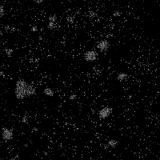

# Introduction

Welcome to Lab 2 of NANO281 - Data Science in Materials Science. So far you should already have basic knowledge of python data science stack and know how to manipulate materials data. In this lab, it is time to put your knowledge into use. We will be solving real materials research problems - using both theoretically computed as well as experimental data using data science techniques. 

# Getting started

Same as previous lab, you need to set up your computer environment before the lab. 

1. Activate your nano281 virtual environment.
```bash
conda activate nano281
```

2. Start a Jupyter notebook.
```bash
jupyter notebook
```

3. Create a Python 3 notebook and rename it `nano281-lab2-<first_name>-<last_name>`.

# Assessment criteria
Try to complete all questions, doing everything in your Jupyter notebook. Make generous use of code cells, text cells, etc. and write your notebook as though it is a lab report but with Python code incorporated. The easier you make it for your instructors to find the answers, the better.

At the end of the lab, please submit the `nano281-lab2-<first_name>-<last_name>.ipynb` file (it should be in whatever directory you started your jupyter notebook application in) via Google classroom.

Our assessment criteria:

- Model performance: 30%
- Materials Science Insights: 30%
- Data Science Technique: 30%
- Programming Style: 10%


# Lab

Download `data.csv` file in this repo. It contains basic data for all materials in the Materials Project.

## Q1 - Exploratory data analysis (10 points)

Load the `data.csv` in variable `orig_data` using `pandas.read_csv` with `na_filter=False` option, and perform the following analysis. 

1. How many elements are there in this data set?
2. What is the maximum number of elements (`max_el`) in a single structure?
3. Plot a barplot of the number of materials having 1, 2, 3, ... `max_els`. Use a log scale for the y-axis.
4. Count the number of materials where each element is present. Sort this count and answer the following questions. What are the 10 most common elements in this data set? and what are the 10 least common elements in this data set?

Hint: When dealing with formula, you may use `pymatgen.Composition` to speed up the process. For example, the following code snippet shows the use of Composition to process formula. For more usage, you may visit [https://matgenb.materialsvirtuallab.org/2013/01/01/Basic-functionality.html](https://matgenb.materialsvirtuallab.org/2013/01/01/Basic-functionality.html) 

```python
from pymatgen import Composition
comp = Composition('Al2O3')
print(comp.elements)  # this will give you the elements
print(comp.to_data_dict['unit_cell_composition'])  # this will give you the elementstr-stoichiometry dictionary.

```
## Q2 - Data cleaning and feature computations (20 points)

About 80% of the effort in ML modelling is in data processing. The goal is to develop ML models to predict the formation energy per atom and band gap of the material from the formula. To do that, we will first convert the formula to numeric vectors (descriptors) for model inputs. 

1. Filter out materials that contain noble gas elements and save it in variable `data`. How many materials are left? Store this number in the variable `n`.
2. Load the element property data file `element_properties.csv` in variable `element_data` using pandas by setting `index_col=0` in `pandas.read_csv` function. How many NaN (Not a Number) are there in each column? 
3. Compute the mean values for each column, ignoring the NaNs. For each column, fill the NaN with the mean value of that column. This is a common data imputation technique.
4. Compute the composition-averaged `AtomicRadius` for all materials and store the results in variable `atomic_radius`. For example, averaged `AtomicRadius` for `Li2O` can be computed as `(2 * 1.45 + 0.6) / 3`, where `1.45` is the `AtomicRadius` for `Li` and `0.6` is the `AtomicRadius` for `O`.
5. Compute the composition-averaged properties for all properties in `element_data` and for all materials. Store the results in the variable `average_properties`. `average_properties` should have a dimension of `(n, 16)` where n is the number of materials and 16 is the number of properties.
6. Similar to the previous computations of average properties, compute the maximum properties and minimum properties for all properties and all materials, and store them in variables `max_properties` and `min_properties` respectively. Both variables should have dimension `(n, 16)`.
7. Concatenate `average_properties`, `max_properties` and `min_properties`, and store the result in variable `design_matrix` with dimension `(n, 48)`. 

## Q3 - Regression and classification modeling (40 points)

We are going to use `band_gap`, `formation_energy_per_atom`, `e_above_hull` in `data` as the targets, and store them in variable `targets`. `targets` should be a dataframe with dimension of `(n, 3)`. 

1. Split the data (`design_matrix` as X, and `targets` as y) into training and test sets in the ratio 90%:10%. Store the training data in variables `train_X` and `train_y` and the test data as variables `test_X` and `test_y`. To make sure the data is reproducible, set the `random_state=42` in `sklearn.model_selection.train_test_split`.
2. Compute the mean and standard deviation of columns in `train_X`. Both of them should be length 48 vectors. Use them to normalize `train_X` and `test_X`, so that each column has a mean of 0 and standard deviation of 1. Store the normalized design matrices to `norm_train_X`, `norm_test_X`. 
3. Train a linear model to predict `formation_energy_per_atom`. What are the mean absolute error (MAE) and root mean squared error (RMSE) on the test data?
4. Train a Ridge regression model and a LASSO regression model using `alpha=0.1`, what are the test MAE and RMSE?
5. Let's define `band_gap < 0.001` as metallic and `band_gap >= 0.001` as nonmetallic. Construct linear discriminant analysis, quadratic discriminant analysis, and logistic regression models on train data and predict the accuracy of the models on test data. 
6. What are the problems of using only the compositions to predict material properties?

## Q4 - Clustering (30 points)

In this problem, we will be looking at catalyst clusters. The image file `catalyst.png` below is extracted from a figure shared on figshare by Gomez-Bolivar et al. (Front. Microbiol., 20 June 2019, DOI: 10.3389/fmicb.2019.01276). It is an energy dispersive X-ray (EDX) microanalysis of Pd/Ru bimetallic nanoparticle catalysts synthesized by Escherichia coli. For this whole exercise, it is recommended that you use the `hot` colormap in matplotlib.



1. Read in the image as a numpy array using matplotlib. Show the image in your Jupyter notebook. What are the dimensions of the array?
2. Plot the distribution of the values in the numpy array representing the image. Note that the values in the numpy array are between zero and 1.
3. Measured images has a variety of levels. Sometimes, we want to label each pixel at pre-specified levels, e.g., 0 representing the background, and fixed values representing certain features. This is known as vector quantization. Here, we will quantize the image using K-means. We know for a fact that there are two elements (Pd and Ru) in the system. Using K-means, quantization the image such that there are three levels representing the background, and one level for each element. Ensure that 0 corresponds to the background (this should be the cluster with the largest number of data points) and non-zero levels correspond to the elements. Plot the quantized image.
4. For the purposes of this exercise, we will not attempt to distinguish between different elements. Any value within the numpy array that is > 0 is considered a catalyst particle. Use K-means clustering to distinguish identify clusters of metal particles (you will need to figure out what a good value of K is). Plot your clustered image, ensuring that each cluster has a different color. Comment on how you chose your value of K.
5. Finally, we will use a density-based clustering method called DBSCAN. Similar to part 4, any value in the numpy array that is > 0 is considered a catalyst particle. Use DBSCAN clustering to distinguish identify clusters of metal particles (you will need to figure out what a good value of `eps` is). Plot your clustered image, ensuring that each cluster has a different color. Comment on how you chose your value of `eps`.
6. Discuss on the differences between the K-means and DBSCAN results, and which method is more appropriate for the purpose we are using it for.
