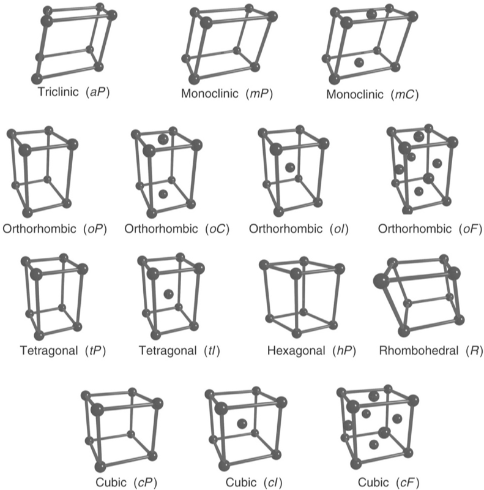

# Introduction

Welcome to the final lab of NANO281 - Data Science in Materials Science. Unlike previous labs, this lab will be based on an *open* problem in materials science: how do we determine crystal structure from a diffraction pattern, specifically an X-ray diffraction pattern?

# Getting started

Same as previous lab, you need to set up your computer environment before the lab. 

1. Activate your nano281 virtual environment.
```bash
conda activate nano281
```

2. Start a Jupyter notebook.
```bash
jupyter notebook
```

3. Create a Python 3 notebook and rename it `nano281-lab2-<first_name>-<last_name>`.

# Assessment criteria

Try to complete all questions, doing everything in your Jupyter notebook. Make generous use of code cells, text cells, etc. and write your notebook as though it is a lab report but with Python code incorporated. The easier you make it for your instructors to find the answers, the better.

At the end of the lab, please submit the `nano281-lab2-<first_name>-<last_name>.ipynb` file (it should be in whatever directory you started your jupyter notebook application in) via Google classroom.

Our assessment criteria:

- Model performance: 30%
- Materials Science Insights: 30%
- Data Science Technique: 30%
- Programming Style: 10%


# Lab

Now that we are at the Final Lab, hints will be minimal. In any case, the problem itself is an *open-ended* one where the instructors have no clear idea what the best final solution would be (though we can make intelligent guesses). It is expected that your ML models are properly trained using best practices.

## Data

Download the `cod.csv` file in this repo. Each row of the csv represents a single unique crystal:
- id: COD id
- formula: Formula
- int_num: International Space Group Number. This is an integer ranging from 1-230.
- 180 coloumns of intensity values at 2theta ranging from 0.5 to 90 degrees in 0.5 degree intervals.
- bravais_lattice: Bravais lattice. This is one of 14 string values (aP, mP, mS, oP, oS, oI, oF, tP, tI, cP, cI, cF, hP, hR). The first letter denotes the crystal system (a: anortic or triclinic; m: monoclinic; o: orthorhombic; t: tetragonal; c: cubic; h: hexagonal) and the second letter denotes the centering (P: primitive; S: side centered (a collective for the more commonly used A, B or C centerd); I: body centered; F: face centered; R: rhombohedral; H: hexagonal).





## Q1 - Predicting bravais lattice from XRD

Develop a machine learning (ML) model to classify an XRD pattern into one of the 14 Bravais lattices. Experiment with any or all of the ML models that you have learnt so far in the course, and play around with various parameters. Given the size of the data, it is recommended that you sample only 10000 data points and use that to experiment with your models first, before trying to use the full data set to do a proper fit.

Please save your best 3 models using:
```
import pickle
with open('<First_name>_<Last_name>_<description of model, e.g., linear, tree, etc.>.pickle') as f:
  pickle.dump(model, f)
```

Generate a csv with your model predicitons with two columns:
- id: COD id
- pred_bravis_lattice: Predicted Bravais Lattice from your model.

Report your classification accuracy.
